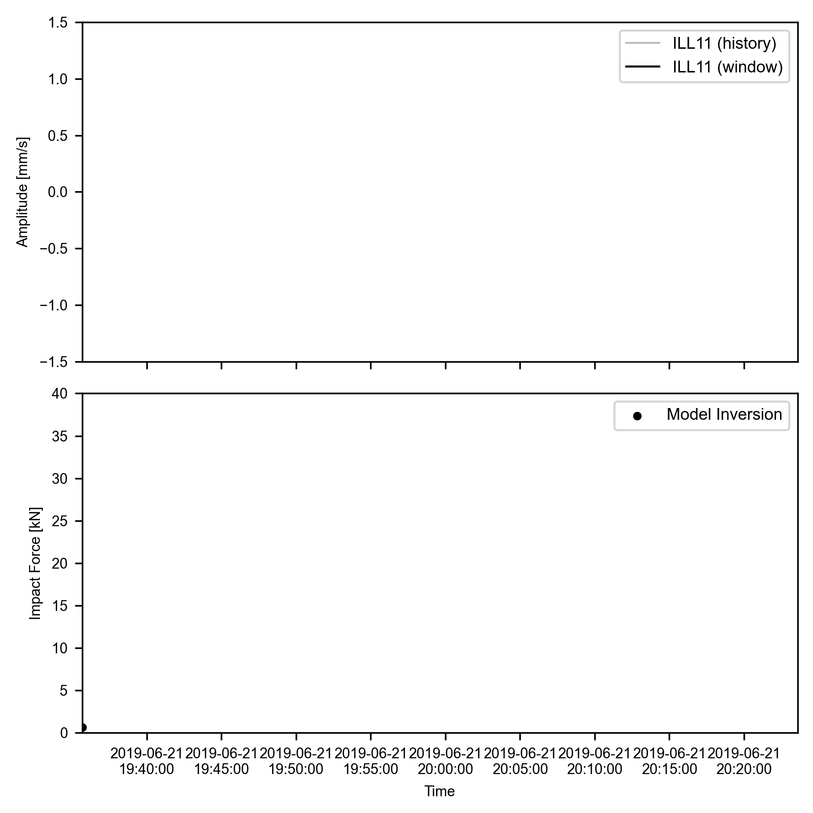
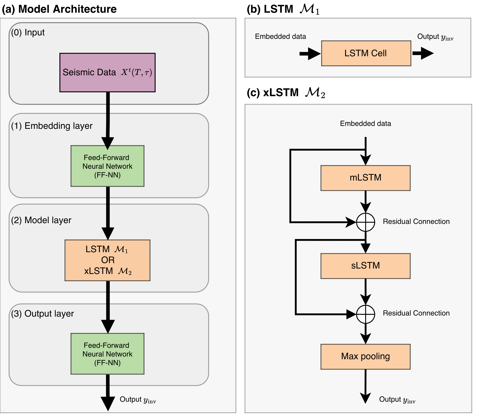
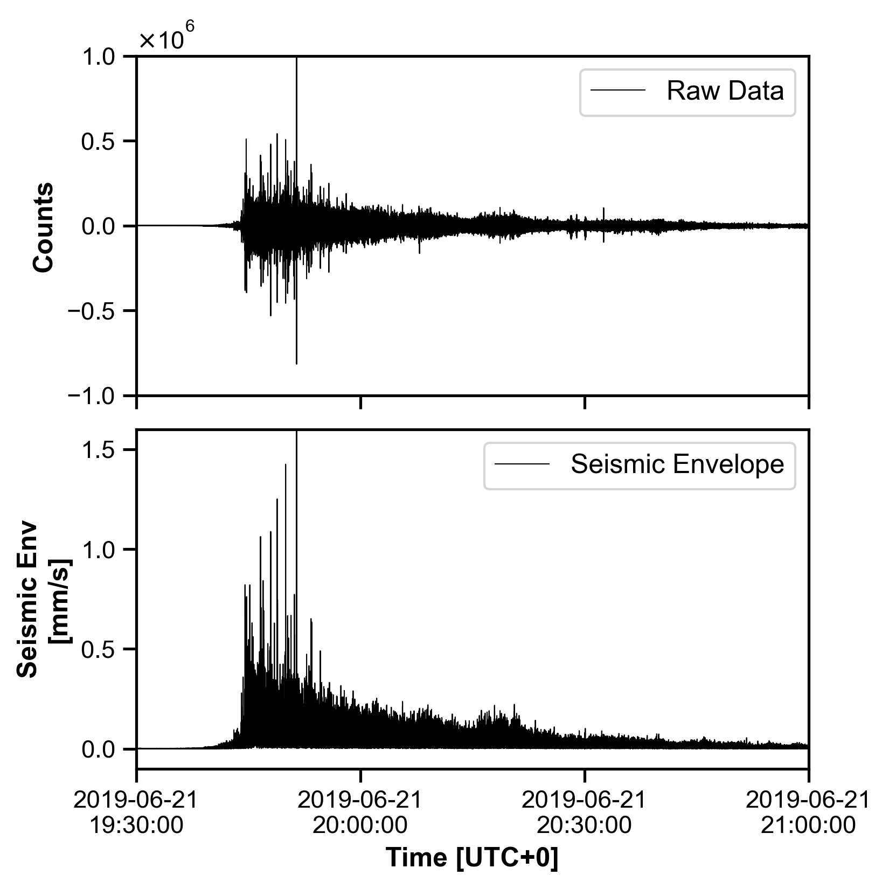
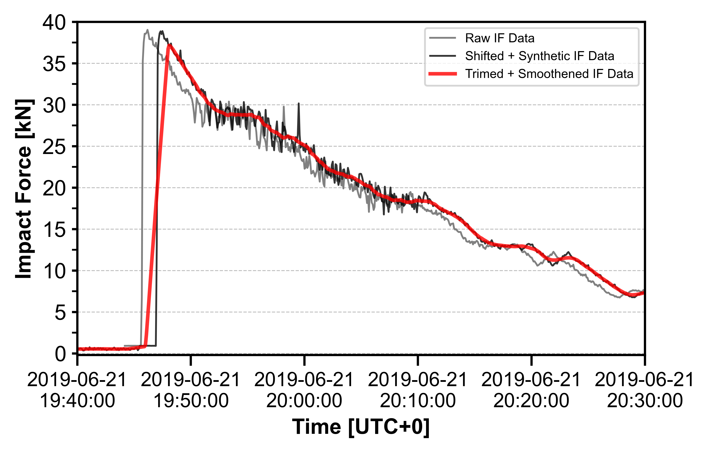
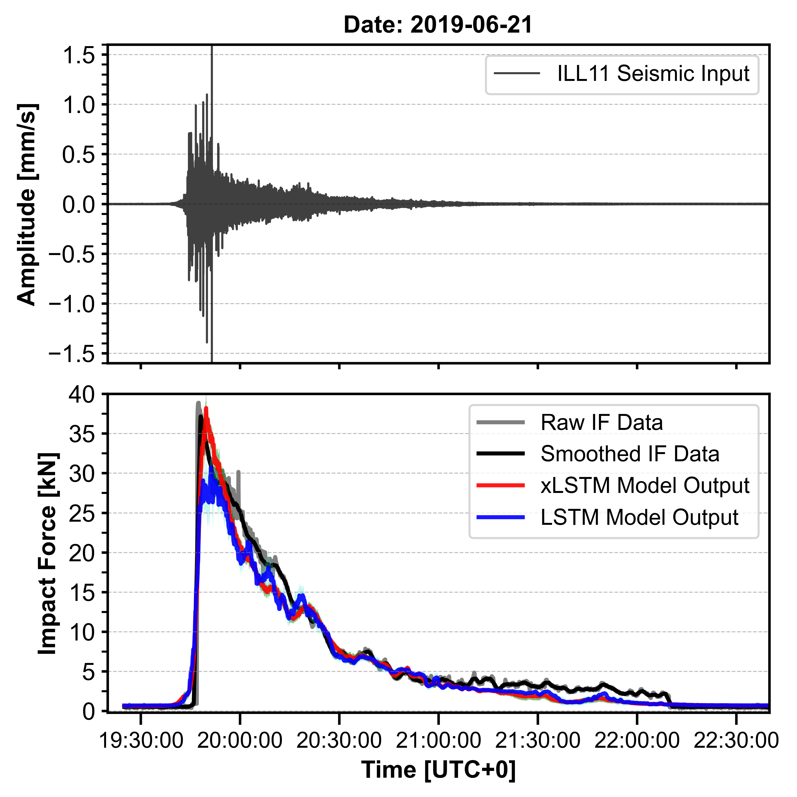
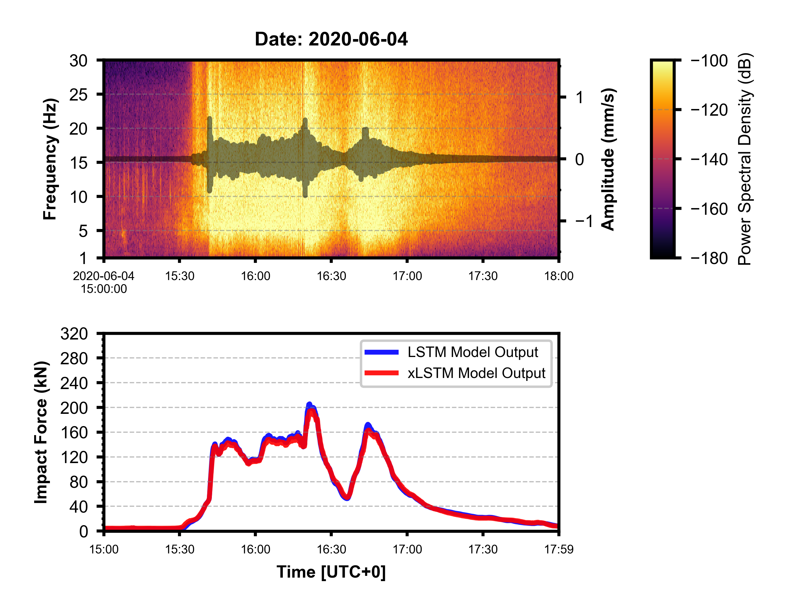

# Machine Learning Inversion of Debris Flow Impact Forces from Seismic Signals using xLSTM

This repository details the method and models trained to invert basal impact force from seismic signals generated by debris flow events in the Illgraben catchment in Switzerland.



## Models
### LSTM (Baseline)
As a baseline, the LSTM model is used. The model class can be found in `./models/LSTM_model.py`. 

### xLSTM - Extended LSTM
For the state of the art model, the xLSTM model is chosen. The model classes can be found in `./model/xLSTM_model.py`. 



## Data Preprocessing
To remove the sensor response, refer to `./data_preprocessing/remove_sr.py`. 



The original impact force data was in UTC+1 time, to shift it back to UTC+0, `./data_preprocessing/shift_utc.py`. 

For shifting the peak of the impact force, refer to `./data_preprocessing/shift_peak.py`. In this file, the peak can be shifted using "average" or "dynamic" methods. The usage is as follows :
```bash
python shift_peak.py --time_shift --from_velocity --avg_shift
```

To perform moving average smoothing of the data in 10, 30 and 60 second windows, refer to `./data_preprocessing/smooth_data.py`. The usage is as follows : 
```bash
python smooth_data.py --time_shift "average" --smooth --plot
```



## Model Training
The model training is carried out using files located in `./functions/training/`.
- `train.py` contains the training class used to train both models.
- `train_xlstm.py` contains the training process for the xLSTM model. It initializes the dataloaders, model and runs the evaluation. Its usage is as follows :
```bash
python train_xlstm.py \ 
    --test_event_id "1" \
    --val_event_id "3" \
    --time_shift_mins "average" \
    --interval "5" \
    --station "ILL11" \
    --task "comparison_baseline_cv" \
    --smoothing "30" \
    --config_op "default" \
    --divide_by "45" \
    --repeat "3"
```
- `train_lstm.py` contains the training process for the LSTM model. It initializes the dataloaders, model and runs the evaluation. Its usage is similar to the one shown above.



## Model Application
The trained models can be used using the files in `./functions/application`
- `test_models.py` lets the user apply saved models to unseen seismic data in an ensemble approach. It assumes the data is stored in the directory location set in `./config/paths.json` Its usage is as follows :
```bash
python test_models.py \ 
    --network "9S" \ 
    --station "ILL11" \ 
    --component "EHZ" \ 
    --year "2020" \ 
    --julday 156 \ 
    --interval 5 \ 
    --model_type "xLSTM"
```
- `compile_results.py` can be run after testing the model to compile the ensemble output into a mean and standard deviation.



## Contributors
**[Kshitij Kar](https://github.com/Kshitij301199)** 
<br>kshitij.kar@gfz.de<br> or 
<br>kshitij787.ak@gmail.de<br>